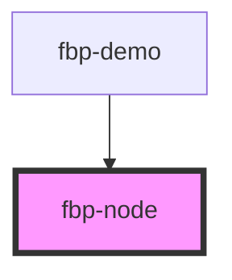

# fbp-node

<!-- Auto Generated Below -->

## Properties

| Property | Attribute | Description | Type     | Default     |
| -------- | --------- | ----------- | -------- | ----------- |
| `nodeId` | `node-id` |             | `string` | `undefined` |

## Methods

### `activate(state: boolean) => Promise<void>`

#### Returns

Type: `Promise<void>`

## Dependencies

### Used by

 - [fbp-demo](../demo)

### Graph

----------------------------------------------

*Built with [StencilJS](https://stenciljs.com/)*
